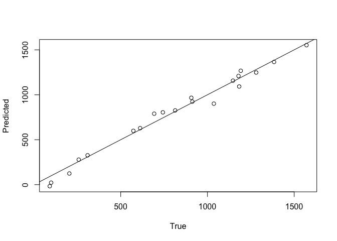

<!-- README.md is generated from README.Rmd. Please edit that file -->

# kitchen: Convolutional Kitchen Sinks in R

<!-- badges: start -->
<!-- badges: end -->

**kitchen** is an R package that provides tools to implement
convolutional kitchen sinks, also known as convolutional random
features, in R. These tools allow you to generate random features from
data, train models, identify what set of hyperparameters produce
best-performing models, and predict values from data.

## Installation

You can install the development version of kitchen from
[GitHub](https://github.com/avery-kruger/kitchen) with:

``` r
# install.packages("devtools")
devtools::install_github("avery-kruger/kitchen")
```

## Details

Details on various functions can be found in their respective
documentation pages. For a complete list of functions, use library(help
= kitchen).

## Example

Here is a simple example of how to implement **kitchen**:

Let there be some data, *x*, that has a complicated relationship with an
outcome, *y*.

``` r
library(kitchen)
x <- matrix(sample(1:10,10000,TRUE),2000,5)
y <- 5*x[,1] + 20*x[,1]*x[,2] + 3*x[,3]^2 - 10*x[,4] - 2*x[,5]
```

We can test CKS across a variety of feature and window sizes to
determine the best performing hyperparameters by using **kitchen_sweep(
)**. This presents R<sup>2</sup> values of prediction-to-true value for
each combination of feature and window sizes.

``` r
kitchen_sweep(x[1:1000,],y[1:1000],
   x[1001:2000,],y[1001:2000],
   2^(4:8),2:5, verbose = F)
#>             2         3         4         5
#> 16  0.6132109 0.8180464 0.9220285 0.9203979
#> 32  0.6122578 0.8409847 0.9225346 0.9524986
#> 64  0.6119458 0.8421398 0.9319825 0.9665591
#> 128 0.6118863 0.8556787 0.9473810 0.9762115
#> 256 0.6131870 0.8554886 0.9483183 0.9851318
```

Models with 5 features appear to perform well, and feature counts beyond
64 don’t appear to make a difference.

Now, we can make a prediction on some new data using
**kitchen_prediction( )**. We’ll use the hyperparameters we determined
work well and bootstrap to generate a distribution of predictions based
on our sampling of the data.

``` r
a <- matrix(sample(1:10,100,TRUE),20,5)
b <- 5*a[,1] + 20*a[,1]*a[,2] + 3*a[,3]^2 - 10*a[,4] - 2*a[,5]

mybootstrap <- kitchen_prediction(x, y, a,
                                  features=64, windows=5,
                                  bootstrap=10, verbose = F)
```

Lets plot the mean of our predictions versus the true values alongside a
1:1 line to see how well our predictions did. This is of course only
possible in simulated data.

``` r
plot(b, rowMeans(mybootstrap[[1]][[1]]),
     xlab = "True", ylab = "Predicted"); abline(0, 1)
```



## Author(s)

Avery M. Kruger

Maintainer: Avery M. Kruger, <avery.kruger@botany.ubc.ca>

## References

Kruger, A. M., Shankar, V., Davies, T.S. (2024) Inferring the
Evolutionary Model of Community-Structuring Traits with Convolutional
Kitchen Sinks. Systematic Biology (In Press).
