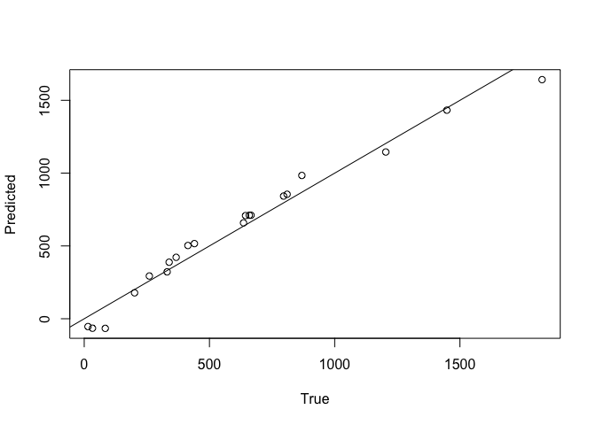

<!-- README.md is generated from README.Rmd. Please edit that file -->

# kitchen: Convolutional Kitchen Sinks in R

<!-- badges: start -->
<!-- badges: end -->

**kitchen** provides tools to implement convolutional kitchen sinks,
also known as convolutional random features, in R. These tools allow you
to generate random features from data, train models, identify what set
of hyperparameters produce best-performing models, and predicting from
data.

## Installation

You can install the development version of kitchen from
[GitHub](https://github.com/avery-kruger/kitchen) with:

``` r
# install.packages("devtools")
devtools::install_github("avery-kruger/kitchen")
```

## Example

Here is a simple example of how to implement **kitchen**:

``` r
library(kitchen)
## Let there be some data, x, that has a complicated relationship with y.
x <- matrix(sample(1:10,10000,TRUE),2000,5)
y <- 5*x[,1] + 20*x[,1]*x[,2] + 3*x[,3]^2 - 10*x[,4] - 2*x[,5]

#Determine the best performing hyperparameters with kitchen_sweep()
kitchen_sweep(x[1:1000,],y[1:1000],
   x[1001:2000,],y[1001:2000],
   2^(4:8),2:5, verbose = F)
#>             2         3         4         5
#> 16  0.5412895 0.7965890 0.8953042 0.8944626
#> 32  0.5426115 0.8249299 0.9013947 0.9227606
#> 64  0.5435026 0.8378835 0.9276522 0.9729043
#> 128 0.5435981 0.8382451 0.9373876 0.9775089
#> 256 0.5438259 0.8380298 0.9390492 0.9817828
#Models with 5 features appear to perform well.

#Now, predict b given data with the same organization as x.
a <- matrix(sample(1:10,100,TRUE),20,5)
b <- 5*a[,1] + 20*a[,1]*a[,2] + 3*a[,3]^2 - 10*a[,4] - 2*a[,5]

mybootstrap <- kitchen_prediction(x,y,a,
                                  features=64,windows=5,bootstrap=10,
                                  verbose = F)

#Lets plot the mean of our predictions versus the true values
plot(b, rowMeans(mybootstrap[[1]][[1]]),
     xlab = "True", ylab = "Predicted"); abline(0, 1)
```



## Author(s)

Avery M. Kruger

Maintainer: Avery M. Kruger, <avery.kruger@botany.ubc.ca>

## References

Kruger, A. M., Shankar, V., Davies, T.S. (2024) Inferring the
Evolutionary Model of Community-Structuring Traits with Convolutional
Kitchen Sinks. Systematic Biology (In Press).
